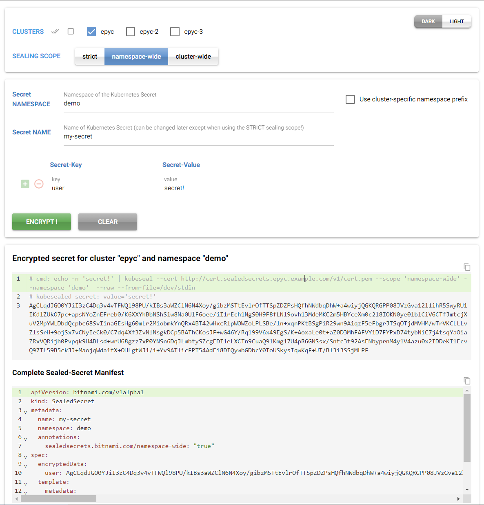

# About
A simple web-gui for Bitnami's [sealed-secrets](https://github.com/bitnami-labs/sealed-secrets/), based on the awesome [nicegui](https://nicegui.io/) Python UI framework.  
  
The actual secret encryption process is done on the server-side using the kubeseal binary, so be sure to use a secure connection to access this web-app!  
As we simply use `kubeseal --cert <URL> ...` for secret encryption internally, the host serving this web-app is the only one requiring http/s access to the sealedsecrets controller web-url, to retrieve the public encryption key.
## Features
- Encrypt multiple secrets all at once.
- Supports encrypting for multiple clusters with different encryption keys.
- Choose [sealing-scope](https://github.com/bitnami-labs/sealed-secrets/?tab=readme-ov-file#scopes): *strict, namespace-wide, cluster-wide*
  - *cluster-wide* scope is potentially dangerous and can be disabled in `config.yaml`
- Fetches encryption key via http/s from the sealed-secrets controller URL
- Generates the encrypted string + the complete *sealed-secrets* manifest
- Copy buttons for easy *copy & paste* of encrypted strings.
- Configurable settings and cluster URLs in *config.yaml*


# Building

## Prereqs:

- Download kubeseal and unpack to bin/ directory!  
  Example for kubeseal v0.26.3:
    ```
    cd bin && \
    curl  -o ks.tgz -L https://github.com/bitnami-labs/sealed-secrets/releases/download/v0.26.3/kubeseal-0.26.3-linux-amd64.tar.gz \
    && tar xzf ks.tgz kubeseal \
    && rm ks.tgz
    ```
 -  Build the image and push to your registry, eg:
    ```
    docker compose build --push
    ```
 
 
# Deploying
## Prereqs:
- Sealed-Secrets controller installed in your cluster ;-)  =>
  [Install Sealed-Secrets](https://github.com/bitnami-labs/sealed-secrets/?tab=readme-ov-file#installation)
  
- Ingress exposing your sealed-secrets controller public encryption-key!  
  Can easily be done during installation using Bitnami's Helm chart:
  ```
  values:
    ingress:
      enabled: true  # default: false
      hostname: "cert.sealedsecrets.east.example.com"
      # optional: Default path for the ingress record
      # path: /v1/cert.pem
  ```


## Deploy to k8s
- See folder [k8s](./k8s/). 
- Uses *kustomize*. Modify/create overlay if required.
- Deploys to namespace `sealed-secrets` by default!  

```
kustomize build k8s/env/demo | kubectl apply -f -
```

# Configuration
## config.yaml

```
# clusters dictionary
# 
# CLUSTERNAME:
#    url: <URL OF SEALED-SECRETS ROUTE>
#    namespacePrefix: "dev-"  # will be prepended to the namespace's name
#    enabled: true | false    # set the cluste's checkbox to checked or unchecked initially

defaults:
  enable-cluster-wide-encryption: true
  max-secrets: 5

clusters:
  east:
    url: http://cert.sealedsecrets.east.example.com/v1/cert.pem
    namespacePrefix: east-
    enabled: true

  west:
    url: http://cert.sealedsecrets.west.example.com/v1/cert.pem
    enabled: false
    namespacePrefix: west-

  global:
    url: http://cert.sealedsecrets.global.example.com/v1/cert.pem
    enabled: false
```

# Demo

